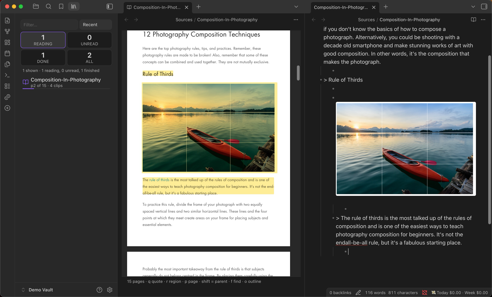
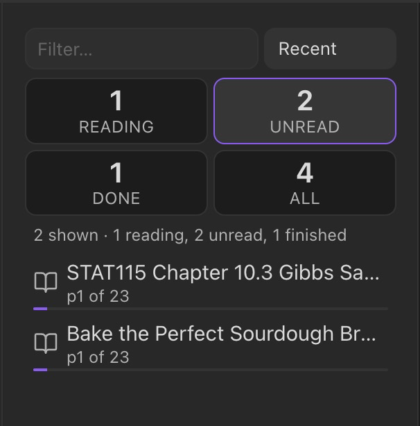
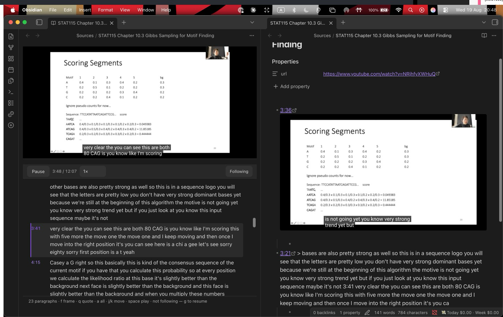
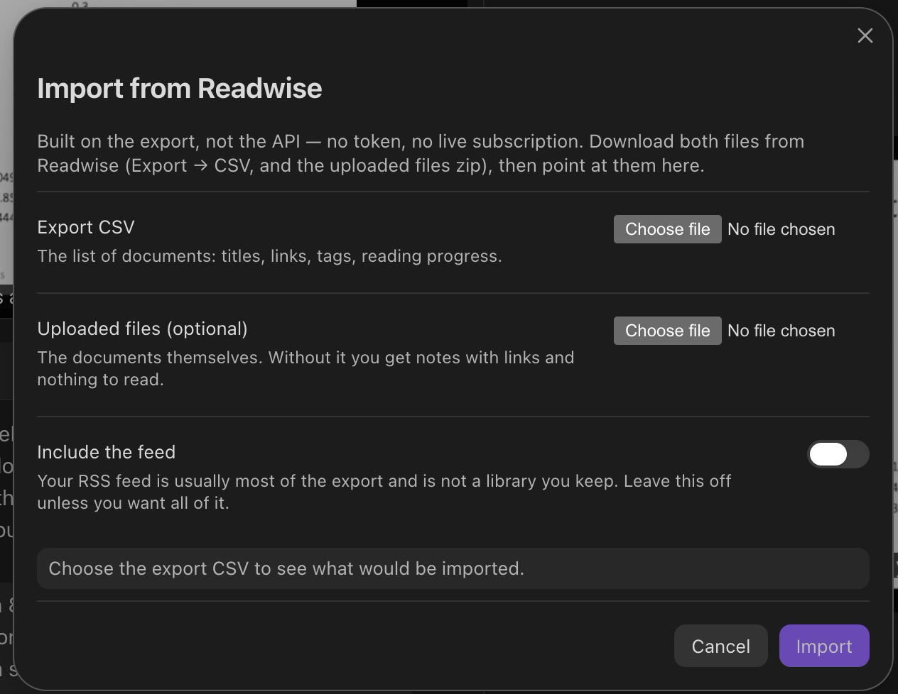

# Democratised Read It Later

**Read the document inside Obsidian and choose what goes into your vault. Clip a
passage or drag a box around a figure, have it land as a quote or an image, and
type your own prose underneath it.**

Bulk-extracting a PDF into markdown gives you a transcript — something you read
past, not something you write in. Reader inverts that: nothing enters your vault
until you point at it. What you keep is a note you wrote, with the source's own
words and figures anchored inside it.



```md
- > A random-length gap is then inserted at the same, randomly chosen place. ^hl-01k9
	- This is the operator that makes SAGA's search non-local — worth comparing
	  to the block-move operator in §6.4.
```

That is the whole output format. A bullet with the clip, your writing nested
underneath, and a block id so the highlight can find its way home.

- **PDFs, EPUBs, saved web articles, and YouTube transcripts.**
- **Runs offline.** No network requests at all unless you switch on the optional
  AI feature and supply your own key.
- Desktop and mobile (Obsidian 1.9+); a few features are desktop-only and say so.
- MIT licensed — see [LICENSE](LICENSE). Recent changes: [CHANGELOG.md](CHANGELOG.md).

## Contents

- [Getting started](#getting-started) — open your first document
- [The keys](#the-keys) — the whole interaction surface
- [How clipping works](#how-clipping-works) — quotes, figures, and the two-file contract
- [Nesting and parents](#nesting-and-parents) — structure a note as you read
- [The library](#the-library) — a shelf for what you are part-way through
- [Sources](#sources) — PDFs · EPUBs · articles · video
- [Leaving Readwise](#leaving-readwise) — import the export, no token
- [Excalidraw handoff](#excalidraw-handoff) — send clipped figures to a drawing
- [AI transcription](#ai-transcription-optional) — an equation to LaTeX, opt-in
- [Settings](#settings) · [Limitations](#limitations) · [Development](#development)

## Getting started

1. **Install & enable.** Copy `main.js`, `manifest.json` and `styles.css` into
   `.obsidian/plugins/democratised-read-it-later/`, then Settings → Community plugins → enable
   **Democratised Read It Later**.
2. **Open a document.** Right-click any PDF, EPUB or `.html` in the file explorer
   and choose **Open in Reader**. (Reader registers its own `.reader` file type
   rather than taking over `.pdf`, so Obsidian's built-in PDF viewer keeps
   working exactly as before.)
3. **Clip something.** Select a sentence and press <kbd>q</kbd>. It lands in the
   note beside the document, as a bullet, with your cursor on the line beneath it.
4. **Write.** That indented line under the quote is yours.

Opening a document creates two files in `Sources/`:

| File | What it holds |
| --- | --- |
| `<name>.reader` | Where each clip came from — page, rectangle, quote anchor. Never rendered into a note. |
| `<name>.md` | What you kept. An ordinary markdown note you can grep, link and edit by hand. |

The split is the point: the note stays clean and citable, and the provenance —
the coordinates, the anchors, the ugly part — lives next to it rather than
inside it.

## The keys

| Key | Does |
| --- | --- |
| <kbd>q</kbd> | Clip the selected text as a quote |
| <kbd>r</kbd> | Drag a box; the region becomes a PNG in your note |
| <kbd>p</kbd> | Clip the whole page as an image |
| <kbd>f</kbd> | Find in document · on a video, capture the current frame |
| <kbd>a</kbd> | *(video)* Clip the whole paragraph you are on |
| <kbd>j</kbd> <kbd>k</kbd> / <kbd>↓</kbd> <kbd>↑</kbd> | *(video)* Move a paragraph, taking the video with you |
| <kbd>space</kbd> | *(video)* Play or pause |
| <kbd>g</kbd> | *(video)* Resume following after you have read ahead |
| <kbd>o</kbd> | Toggle the outline |
| <kbd>x</kbd> | Transcribe a region (needs the AI feature on) |
| <kbd>shift</kbd> + any clip key | Make it a **parent** — everything after nests underneath |
| <kbd>esc</kbd> | Leave whatever mode you are in |

## How clipping works

A clip **materialises**. It becomes a real quote or a real PNG in your vault, not
a pointer into a file that might move. This is a deliberate choice: in the vault
this was built for, 174 of 348 PDF page references in Excalidraw drawings were
already broken because the PDF they named no longer existed anywhere. A pointer
is not storage.

Quotes are rebuilt from the **geometry** of the text layer rather than from what
the browser thinks you selected — which is what stops a two-column page handing
you the figure caption sitting beside the sentence you actually highlighted.

Highlights survive: reopen a document and the marks are still on the page,
positioned as fractions of it, so they stay put at any zoom or window size.

**Delete a bullet from the note and the highlight goes with it.** The note is the
source of truth; nothing you removed comes back.

## Nesting and parents

Press <kbd>shift</kbd> with any clip key to make that clip a **parent**. Everything
you clip afterwards nests underneath it, until you make another one:

```md
- ![[Sources/_assets/p14-msx2s38l.png]] ^hl-02be
	- > Two positions are randomly chosen in the alignment. ^hl-02bf
		- P1 and P2 — this is the bit I keep forgetting.
	- > The same length gap is inserted at position P2. ^hl-02bg
```

Parenting is **positional**, not per-page: a parent owns everything from its own
position until the next parent, so a clip from an earlier page than the parent
sits above it, under whichever parent actually precedes it.

## The library

The **Reader library** (command palette → *Open the Reader library*, or *…in a tab*
for the full-width version) is a shelf rather than a file list: it shows how far
through each document you are and how much has come out of it.



- Four counts across the top — **reading**, **unread**, **done**, **all** — click to filter.
- Opens on *Reading* when anything is in progress, because a dozen live documents
  buried in two thousand untouched ones is not a useful default.
- Right-click a row for **Open in Reader**, **Open the note**, and two removals:
  *Remove from library* (only the `.reader`) or *Delete document and note*.
  Both confirm first, tell you how much of your own writing is in the note, and
  move files to trash rather than deleting them.

Three commands reach it from the keyboard: **Search the Reader library** (a fuzzy
quick-switcher), **Continue reading**, and **Open the next unread document**.

## Sources

### PDFs

Rendered by Reader's own pdf.js viewer, one page at a time with a hard memory
budget, so a 315-page workbook is not a dead tab. Reading order is reconstructed
from page geometry, which is what makes selection behave on multi-column pages.

### EPUBs

One spine section at a time, never the whole book. A figure clip takes the
publisher's own image file at full resolution rather than a screenshot of it.

### Web articles

**Save a page by pasting its URL.** *Save a page to Reader* takes a link and
writes the article into your vault as a local document — readable offline,
greppable, clipped with the same keys, and unaffected by the site going away
later. It is sanitised before it is written rather than when it is read, so the
dangerous shapes never reach your disk at all. Only `http` and `https` are
accepted, and a page with no readable text in it fails loudly instead of saving
you an empty file. This is the one thing here that reaches the network without
an API key, and only when you ask it to.

Saved `.html` opens as a readable document. **Images are not fetched.** Every
image in a saved article lives on someone else's server, so loading one tells
that host your IP and the moment you opened the page — which is exactly how a
tracking pixel works. Each image is a placeholder naming its host; click to load
them, per document, per session.

### Video

**Save a video by pasting its link.** *Save a YouTube video to Reader* fetches
the transcript and writes it into your vault as a document you own — searchable,
quotable, and still there after the video is not. Desktop only, and about two
seconds a video.

A YouTube transcript document opens as the video above its transcript, and the
transcript **follows the video as it plays** — the paragraph being spoken is
marked, and the pane scrolls to keep it in view. Scroll by hand and following
stops, because being dragged back mid-sentence is worse than losing your place;
<kbd>g</kbd> resumes it.

Reader supplies the transport rather than YouTube: play/pause, a clock, and a
**speed control**, which is the one a recorded lecture actually needs. The embed
is asked for no controls of its own, and that is not cosmetic — a captured frame
is a photograph of what was drawn, so YouTube's control bar, caption overlay and
end-screen suggestions were all landing inside the pictures.

<kbd>f</kbd> captures the exact frame on screen as a parent, stamped with the
player's own clock. <kbd>q</kbd> quotes a selection and <kbd>a</kbd> takes the
whole paragraph — speech has no sentence breaks worth aiming at, and the whole
paragraph is usually the unit you wanted.

Every video clip carries the second it came from, as a link. Clicking `1:02` in
your note seeks the open video to that moment — which is the difference between
a reference and a citation you can follow.



## Leaving Readwise

**Import from a Readwise export** turns the two files Readwise hands you on the
way out — the CSV and the uploaded-files zip — into ordinary notes you own. No
token, no API, no live subscription: run it and you can cancel the account.



- Shows you exactly what it would write before it writes anything.
- Your **feed is excluded by default** — it is usually most of the export, and it
  is skimmed rather than kept.
- Safe to re-run: a document whose note already exists is skipped whole, never
  merged, because by then that note may have your prose in it.

## Excalidraw handoff

Clipped a page of exam questions? **Send clips from this note to Excalidraw**
opens a gallery of every image clip in the note, and drops the ones you pick into
a drawing with blank working room underneath each — proportional to the clip, so
a whole page gets more room than a one-line definition.

## AI transcription (optional)

**Off by default, and it is the only thing in Reader that touches the network.**

Displayed maths is genuinely unrecoverable from a PDF's text layer — <kbd>q</kbd>
refuses rather than hand you mangled symbols. <kbd>x</kbd> is the answer: drag a
box around an equation and get `$$…$$` back, or a table as markdown.

The result **always** opens in an editable box before anything is written. It is
a suggestion you accept, never a silent write.

> **Your API key is stored in plain text** in this vault's `data.json`, which
> means it syncs wherever your vault syncs and lands in whatever backs it up.
> Leave the key blank to keep Reader completely offline.

## Settings

| Setting | Default | Notes |
| --- | --- | --- |
| Sources folder | `Sources` | Where notes and `.reader` files go |
| Assets folder | `Sources/_assets` | Where clipped images land |
| Clip resolution | 150 DPI | ~80–250 KB a region; lower makes dense slides unreadable when you zoom |
| Excalidraw working room | 66% | Blank space under each clip, as a share of its own height |
| Anthropic API key | *(blank)* | Only used by <kbd>x</kbd>; see the warning above |

Features are individually switchable — Reader itself, the reading skin, the
importers, and AI.

## Limitations

- **Displayed maths cannot be quoted from a PDF.** It is not in the text layer.
  Use <kbd>r</kbd> for the image, or <kbd>x</kbd> to transcribe it.
- **Diagram-heavy pages** with no clean column gutter can still mis-select.
- **Readwise highlights** made *inside* Readwise are behind their v2 API and are
  not imported; the documents and your reading state are.
- **YouTube transcripts need the desktop app.** They are read from a real
  YouTube page in a webview, and there is no webview on mobile. Videos already
  in a Readwise export work everywhere, offline.
- **Apple Books** import is desktop-macOS only and needs Full Disk Access.

## Development

```bash
npm install
npm test          # 829 tests
npm run build     # typecheck + bundle
npm run install-local
```

The codebase keeps a pure core with no `obsidian` import — the capture model,
note writing, anchoring and rect maths are all testable in plain Node, and an
architecture test enforces the boundary.
